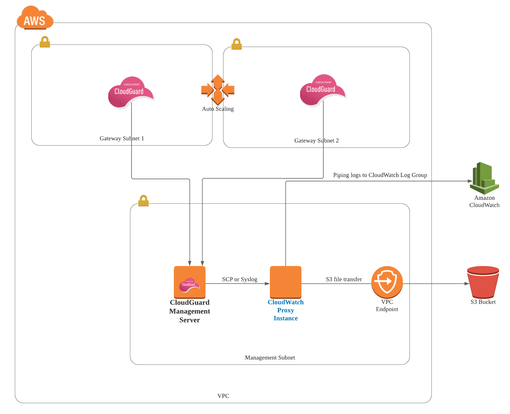
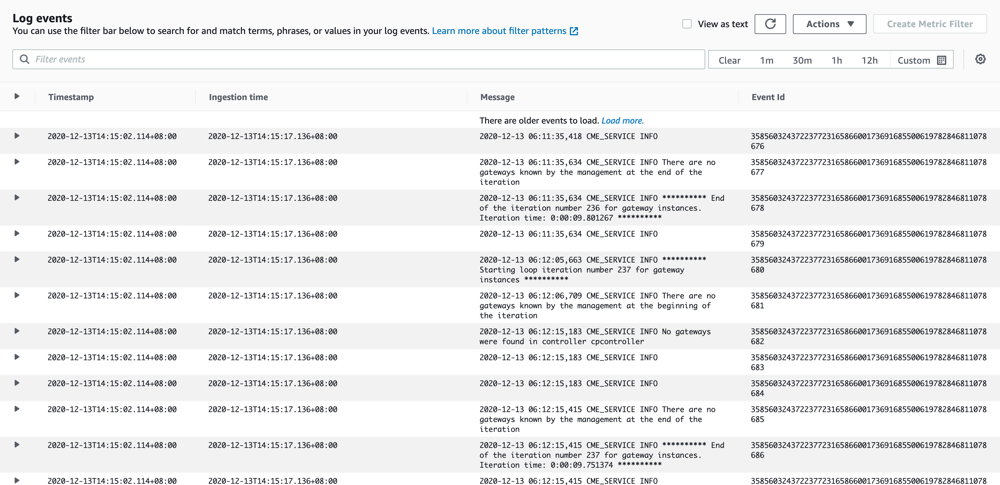
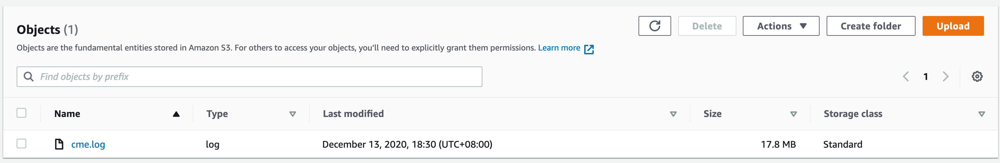

# AWS CloudWatch Log proxy EC2 instance for CloudGuard

This tutorial details a very simple proof-of-concept on forwarding system logs from Check Point CloudGuard Management server to AWS CloudWatch or AWS S3 bucket via an EC2 instance acting as a log forwarder or proxy instance. The need for a proxy instance is because, at this point of time, CloudWatch agent or AWS CLI cannot be installed on the Check Point Management Server due to the management server being hardened. One example use case for this is you might want to pipe CloudGuard's cloud management extension logs (cme.log) to AWS CloudWatch for either log aggregation, troubleshooting or analysis purpose. 

I've created this lab and tutorial based on an actual use case of a customer who has a similar requirement. 



In this lab, we will, firstly, pipe CloudGuard logs (from Management Server) to another EC2 instance with CloudWatch agent installed - Let's call it CloudWatch proxy instance since we are using it as a proxy.

There are multiple ways to pipe logs to the cloudwatch proxy instance. For example, you can use [Check Point Log Exporter](https://supportcenter.checkpoint.com/supportcenter/portal?eventSubmit_doGoviewsolutiondetails=&solutionid=sk122323), and use syslog to transfer to logs to an instance where rsyslog is installed. In this lab, however, we will just be using  SCP file transfer to simplicity's sake. SCP is not the best approach for streaming logs, however, we will be doing a simple proof-of-concept using SCP in this lab.
 
Secondly, we will then forward the logs from the CloudWatch proxy instance to other destinations such as AWS CloudWatch Log Group or S3 bucket. In this lab, we will demonstrate piping CloudGuard Cloud Management Extension logs - ```cme.log``` from Management Server to CloudWatch Logs Group **and** S3 Bucket via the cloudwatch proxy instance.

---

## 1. Setting up CloudWatch proxy instance on AWS

### Launch an EC2 instance 

Firstly, we need to deploy an EC2 instance to act as a "proxy" instance.The instance can be any Linux server. In our lab, we will be using "Amazon Linux". 

If you are not familiar with how to launch an EC2 instance, please check out this [how to launch an EC2 instance.](https://docs.aws.amazon.com/quickstarts/latest/vmlaunch/step-1-launch-instance.html)

You should also set up the instance's networking so that it can communicate with the CloudGuard management server. By default, if it is deployed into a same VPC as Management Server, it can communicate with the management server. We'll also need to make sure that Security Groups of both Management Server and CloudWatch proxy instance allow SSH traffic to and from each other. 


### Configure IAM Role

If your cloudwatch proxy instance already has an IAM role associated with it, make sure that you include the ***CloudWatchAgentServerPolicy** IAM policy. If you don't already have an IAM role assigned to your instance, you can use your IAM credentials for the next steps or you can assign an IAM role to that instance. 

### To configure your IAM role for CloudWatch Logs

Open the IAM console at https://console.aws.amazon.com/iam/.

In the navigation pane, choose Roles. Create a role (e.g.CloudWatchAgentServerRole), and attach the AWS policy called ***CloudWatchAgentServerPolicy** to the role. Or you can use following policy in JSON. 

```bash
{
    "Version": "2012-10-17",
    "Statement": [
        {
            "Effect": "Allow",
            "Action": [
                "cloudwatch:PutMetricData",
                "ec2:DescribeVolumes",
                "ec2:DescribeTags",
                "logs:PutLogEvents",
                "logs:DescribeLogStreams",
                "logs:DescribeLogGroups",
                "logs:CreateLogStream",
                "logs:CreateLogGroup"
            ],
            "Resource": "*"
        },
        {
            "Effect": "Allow",
            "Action": [
                "ssm:GetParameter"
            ],
            "Resource": "arn:aws:ssm:*:*:parameter/AmazonCloudWatch-*"
        }
    ]
}
```

###  Download the CloudWatch Log agent

We will then need to download the CloudWatch Log agent and configure the CloudWatch agent on the EC2 instance (CloudWatch proxy instance) that we've just launched. 

Since we're using Amazon Linux, we can do the following.

```bash 
sudo yum install amazon-cloudwatch-agent
```

For other operating systems, please check out [this AWS Documentation for how to install CloudWatch agent.](https://docs.aws.amazon.com/AmazonCloudWatch/latest/monitoring/download-cloudwatch-agent-commandline.html)

And we will need to;

- Download the sample configuration file [cloudwatch-agent-config.cfg](cloudwatch-agent-config.cfg) from this repository
- Place it in a directory (e.g. /home/user/cloudwatch-config)
- Edit the **file_path** in the configuration file:
```bash
            {
                "file_path": "/opt/aws/amazon-cloudwatch-agent/logs/cme.log",
                "log_group_name": "cme.log",
                "log_stream_name": "cme.log",
                "timezone": "Local"
              },
```

> We are sending cme.log from Management Server to this directory ```/opt/aws/amazon-cloudwatch-agent/logs/cme.log```. Therefore, we will need CloudWatch to collect ```cme.log``` from this directory, and pipe it to a CloudWatch log group called "cme.log". You can change this configuration to suit your requirement.

For more informaiton on [CloudWatch Agent](https://docs.aws.amazon.com/AmazonCloudWatch/latest/monitoring/install-CloudWatch-Agent-commandline-fleet.html)

---

## 2. CloudGuard Management Server Configurations

On CloudGuard Management server, you will need to set up SSH keys, create a script that forwards the logs to proxy instance, and configure a Cron job to schedule piping logs.

### Create SSH Keys

It's best to create a unique pair of SSH keys for the purpose of sending logs from management server to Cloudwatch proxy instance via SSH/SCP.

```bash
ssh-keygen -t rsa
```
This key pair will be used when communicating with CloudWatch Log proxy server via SSH/SCP.


> Make sure that the public key is stored on the **CloudWatch proxy instance** under a user's directory ``` ./ssh/authorized_keys ```.


### Create a SCP script to pipe logs

In this lab we will be sending ```cme.log``` via SCP. This is not a perfect approach for piping logs, but this tutorial aims to present a proof-of-concept, and meant for demonstration purpose only. You can also use other means of streaming logs that suit your requirements.   

On the CloudGuard Management server, we will need to create a script to send CME logs. Download [the script](send-logs-to-proxy.sh) from this repository, and update the variable accordingly. 

```bash
#!/bin/bash
# This script sends CloudGuard Logs from Check Point Management Server to CloudWatch Log proxy server.
# Author: Jayden Kyaw Htet Aung - Check Point Software Technologies

#UPDATE THE FOLLOWING VARIABLES!
sshkey_dir="ssh_keys/mgmt_ssh_key.prv"

#SOURCE DIRECTORY
source_dir="/var/log/CPcme/cme.log"

#USER NAME ON CLOUDWATCH PROXY INSTANCE 
dst_user="not-root"

#CLOUDWATCH PROXY INSTANCE'S IP OR HOSTNAME 
dsthost="10.5.0.8"

#DESTINATION DIRECTORY ON THE CLOUDWATCH PROXY INSTNANCE
dst_dir="/opt/aws/amazon-cloudwatch-agent/logs"

echo send CloudGuard logs to CloudWatch Log Proxy Server: $dsthost

scp -i $sshkey_dir -r $source_dir $dst_user@$dsthost:/$dst_dir

echo Logs sent on `date`
```

Once you've updated it, and store it at, for example, 
***/home/admin/cloudwatch/send-logs-to-proxy.sh*** 

Make it executable:

```bash
chomd +x /home/admin/cloudwatch/send-logs-to-proxy.sh
```

> The script will basically send ```/var/logs/CPcme/cme.log``` to ```/opt/aws/amazon-cloudwatch-agent/logs/cme.log```. 

> And we have already configured CloudWatch Agent on monitor this directory ```/opt/aws/amazon-cloudwatch-agent/logs/cme.log```

### Crontab

We'll need to create a cron job to send logs every 5 minutes by doing ```crontab -e```, and add the following.

```bash
*/5 * * * * /home/admin/cloudwatch/send-logs-to-proxy.sh 
```

> Note: You can edit the interval.

Restart the crond. At this point of time, Cron is scheduled to pipe ```cme.log``` to CloudWatch proxy instance via SCP. Verify that cron is working by checking ```/var/logs/cron```

Expected Output:

```bash
Dec 13 06:20:01 2020 mgmt-geo crond[6743]: (admin) CMD (/home/admin/cloudwatch/send-logs.sh)
```

Also, you should run the script manually to see if the ```cme.log``` gets transferred to the cloud proxy instance. 

---

## 3. Forwarding logs to AWS CloudWatch Log Group

- Go back to CloudWatch proxy instance 
- Go to the directory ```cd /home/user/cloudwatch-config/```
- Assuming that you've followed the instructions to edit the CloudWatch agent configuration file (```cloudwatch-config.cfg```), Execute the following command:

```bash
/opt/aws/amazon-cloudwatch-agent/bin/amazon-cloudwatch-agent-ctl -a fetch-config -m ec2 -c file:cloudwatch-config.cfg -s 
```

This will basically load ```cloudwatch-config.cfg``` and start the cloudwatch agent on the EC2 instance. To ensure that CloudWatch agent is running, execute the following and check the status

```bash
sudo service amazon-cloudwatch-agent status
```

And here is the expected output if the agent is running

```bash
Redirecting to /bin/systemctl status amazon-cloudwatch-agent.service
● amazon-cloudwatch-agent.service - Amazon CloudWatch Agent
   Loaded: loaded (/etc/systemd/system/amazon-cloudwatch-agent.service; enabled; vendor preset: disabled)
   Active: active (running) since Sun 2020-12-13 11:32:41 +08; 2h 8min ago
 Main PID: 3078 (amazon-cloudwat)
   CGroup: /system.slice/amazon-cloudwatch-agent.service
           └─3078 /opt/aws/amazon-cloudwatch-agent/bin/amazon-cloudwatch-agent -config /opt/aws/amazon-cloudwatch-agent/etc/amazon-cloudwatch-agent.toml -envconfig /opt/aws/amazon-cl...

Dec 13 11:32:41 cloudwatch-proxy-instance systemd[1]: Started Amazon CloudWatch Agent.
Dec 13 11:32:41 cloudwatch-proxy-instance systemd[1]: Starting Amazon CloudWatch Agent...
Dec 13 11:32:41 cloudwatch-proxy-instance start-amazon-cloudwatch-agent[3078]: /opt/aws/amazon-cloudwatch-agent/etc/amazon-cloudwatch-agent.json does not exist or cannot read. Skipping it.
Dec 13 11:32:41 cloudwatch-proxy-instance start-amazon-cloudwatch-agent[3078]: Valid Json input schema.
Dec 13 11:32:41 cloudwatch-proxy-instance start-amazon-cloudwatch-agent[3078]: I! Detecting runasuser...
Dec 13 11:32:43 cloudwatch-proxy-instance start-amazon-cloudwatch-agent[3078]: 2020/12/13 11:32:43 Seeked /opt/aws/amazon-cloudwatch-agent/logs/amazon-cloudwatch-agent.log - &{Offset:3...Whence:0}
Dec 13 11:32:43 cloudwatch-proxy-instance start-amazon-cloudwatch-agent[3078]: 2020/12/13 11:32:43 Seeked /opt/aws/amazon-cloudwatch-agent/logs/cme.log - &{Offset:18167501 Whence:0}
Dec 13 11:32:43 cloudwatch-proxy-instance start-amazon-cloudwatch-agent[3078]: 2020/12/13 11:32:43 Seeked /opt/aws/amazon-cloudwatch-agent/logs/test.log - &{Offset:38 Whence:0}
Hint: Some lines were ellipsized, use -l to show in full.

```
### Observe the CloudWatch Log Group (cme.log)

You can see that logs are being forwarded to CloudWatch log group called "cme.log". 



---

## 4. Uploading logs to AWS S3 Bucket

In some cases, you may also want to forward or upload CloudGuard system logs to S3 Bucket for a variety of reasons. 

You can either forward the logs to S3 bucket via cloudwatch proxy instance or upload them directly from Management server (using Curl, for now.)

### Prerequisites 

- The destination S3 Bucket with appropriate bucket policies should already be created. That part is not covered in detail in this tutorial.
- VPC endpoint to S3 bucket should be created for the CloudWatch proxy instance. The secure way to access an S3 bucket is via VPC endpoint rather as opposed to public networks.
- AWS IAM Policy that allows uploading of files to S3 bucket should be attached to the CloudWatch proxy instance's role. (This is for uploading via cloudwatch proxy instance)

> Below is an example policy in JSON format.

``` bash
{
  "Version": "2012-10-17",
  "Statement": [
    {
      "Sid": "Stmt1602483338347",
      "Action": [
        "s3:PutObject"
      ],
      "Effect": "Allow",
      "Resource": "arn:aws:s3:::[YOUR-BUCKET-ARN]/*"
    }
  ]
}
```

### 1. Uploading logs to S3 via Cloudwatch proxy instance 

Download [send-to-s3.sh](send-to-s3.sh) from this repository, and edit it to suit your requirements.

```bash
#!/bin/bash
# This script sends CloudGuard Logs from Check Point  Management Server to CloudWatch proxy instance.
# Author: Jayden Kyaw Htet Aung - Check Point Software Technologies

#UPDATE THE FOLLOWING VARIABLES!
#SET YOUR SOURCE DIRECTORY FROM WHICH LOGS WILL BE SENT
source_dir="/opt/aws/amazon-cloudwatch-agent/logs/cme.log"

#YOUR S3 BUCKET NAME TO PIPE THE LOGS
dst_dir="s3://your-s3-bucket/uploads/cme.log"

echo send CloudGuard logs to CloudWatch Log Proxy Server: $dsthost

aws s3 cp $source_dir $dst_dir

echo Logs sent on `date`

```

This is a simple script that basically uploads ```cme.log``` to the destination S3 bucket. You will need to make it executable and store it in a directory on the ***CloudWatch proxy instance***. 

> For this script to run, you have to have ***AWS CLI*** installed on the instance. Amazon Linux comes with AWS CLI installed. 

### 2. Uploading logs to S3 directly from Check Point Management Server using curl

> Note: This is still work in progress although the script will work in most cases.

If you want to upload the log files directly from Check Point management server, you will first need to attach an S3 policy to management server's role so that it can upload the file to S3 bucket.

Download [curl-to-s3.sh](curl-to-s3.sh) from this repository, and edit it to suit your requirements. And place the script in a directory *e.g. /home/admin/cloudwatch/curl-to-s3.sh)


### Cron Job on the CloudWatch proxy instance or Management Server

For both methods, You will to create a cron job on either server to forward logs every 5 minutes by adding an entry to crond -  ```crontab -e```. For example, 

```bash
*/5 * * * * /home/admin/cloudwatch/curl-to-s3.sh 
```

Run either script manually once to see if the file gets uploaded. Verify the file on AWS S3 console.

   

Your ```cme.log``` is now uploaded to S3 bucket. 

---
# Conclusion

This tutorial discusses a simple demonstration of piping CloudGuard ```cme.log``` to AWS CloudWatch and S3 Buckets via a proxy instance on which AWS CloudWatch agent is installed. I've also added another script (curl-to-s3.sh) for directly uploading log files to S3 bucket using curl. This is just a concept, and as mentioned before, SCP is not a perfect way of piping logs (But it is a simple and yet secure way for a demo!). However, you can apply this concept in other uses cases, and pipe any system-specific logs from hardened virtual appliances to AWS for troubleshooting or analysis purposes.

The major takeaway from this tutorial is once the logs are piped to a cloudwatch proxy instance, you can then forward them to pretty much any AWS monitoring service!


---


Best, \
Jayden Kyaw Htet Aung